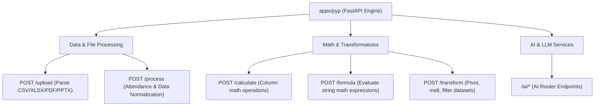

# Python AI & Data Engine (`apps/pyp`)

The **Pyp Application** is a high-performance FastAPI Python microservice. It provides tabular data processing, mathematical column calculations, dynamic formula evaluation, multi-format file extraction, and AI processing routines.

---

## 🛠️ Tech Stack & Dependencies

* **Framework**: FastAPI with Uvicorn.
* **Data Processing**: Pandas, NumPy.
* **File Extractors**: `pdfplumber`, `PyPDF2`, `python-pptx`, `openpyxl`.
* **Config**: Pydantic `Settings` in [`apps/pyp/app/core/config.py`](file:///D:/vscodes/turborepo/f6/apps/pyp/app/core/config.py).

---

## 🚀 Key Endpoints & Services ([`main.py`](file:///D:/vscodes/turborepo/f6/apps/pyp/main.py))

---

## 📄 File Extraction Matrix

The file processing service (`app/services/file_service.py`) automatically detects file extensions and normalizes them into Pandas DataFrames:

| Extension | Library | Parsing Strategy |
| :--- | :--- | :--- |
| `.csv` | `pandas.read_csv` | Direct stream parsing |
| `.xlsx` | `pandas.read_excel` | Sheet structure extraction |
| `.json` | `pandas.read_json` | JSON key-value array parsing |
| `.pdf` | `pdfplumber` | Table extraction per page |
| `.pptx` | `python-pptx` | Table shape extraction from presentation slides |

---

## 🔗 Related Notes
* [[Apps/Server]] — Express backend calling Pyp data endpoints.
* [[Apps/Dashboard]] — Frontend displaying dataset output previews.
* [[Features/API-Reference]] — Complete FastAPI payload models.
