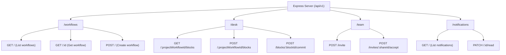

# Express Server Application (`apps/server`)

The **Express Server** application handles core backend REST API services, database operations for Desk Blocks and Workflows, team collaboration invites, and real-time WebSockets.

---

## 🛠️ Architecture & Entrypoint

* **Entrypoint**: [`apps/server/src/index.ts`](file:///D:/vscodes/turborepo/f6/apps/server/src/index.ts)
* **HTTP Server**: Express.js running on port `5000` (configurable via `PORT`).
* **Base Path**: `/api/v1`
* **Middlewares**: CORS, Express JSON parser (`10mb` payload limit), Rate Limiter (`globalLimiter`), and Error Handler.

---

## 🛰️ REST API Modules & Routes

### Route Summary Table

| Base Route | File | Responsibility |
| :--- | :--- | :--- |
| `/api/v1/workflows` | [`workflow.routes.ts`](file:///D:/vscodes/turborepo/f6/apps/server/src/routes/workflow.routes.ts) | Workflow CRUD and versioning |
| `/api/v1/desk` | [`desk.routes.ts`](file:///D:/vscodes/turborepo/f6/apps/server/src/routes/desk.routes.ts) | Desk block creation, reordering, input updates, and commits to MasterSheet |
| `/api/v1/team` | [`team.routes.ts`](file:///D:/vscodes/turborepo/f6/apps/server/src/routes/team.routes.ts) | Collaboration invites, member access, column permissions |
| `/api/v1/notifications` | [`notification.routes.ts`](file:///D:/vscodes/turborepo/f6/apps/server/src/routes/notification.routes.ts) | User notification retrieval and unread toggles |

---

## 📡 WebSockets Manager ([`websocket.ts`](file:///D:/vscodes/turborepo/f6/apps/server/src/websocket.ts))

* **Path**: `/ws`
* **Features**:
  * Registers client sockets under `userId` (passed via URL query string or `AUTHENTICATE` message).
  * Heartbeat / Ping-Pong mechanism every 30 seconds to clean up dead connections.
  * Targeted user notifications via `webSocketManager.sendToUser(userId, payload)`.
  * Global broadcast capability via `webSocketManager.broadcast(payload)`.

---

## 🔗 Related Notes
* [[Features/API-Reference]] — Full API payload specifications.
* [[Packages/Database-Package]] — Database service queries executed by server controllers.
* [[Apps/Pyp-Python-AI]] — Python data engine called by server services.
