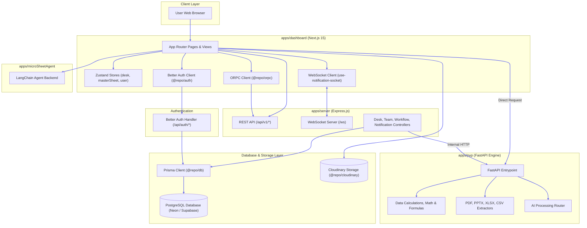
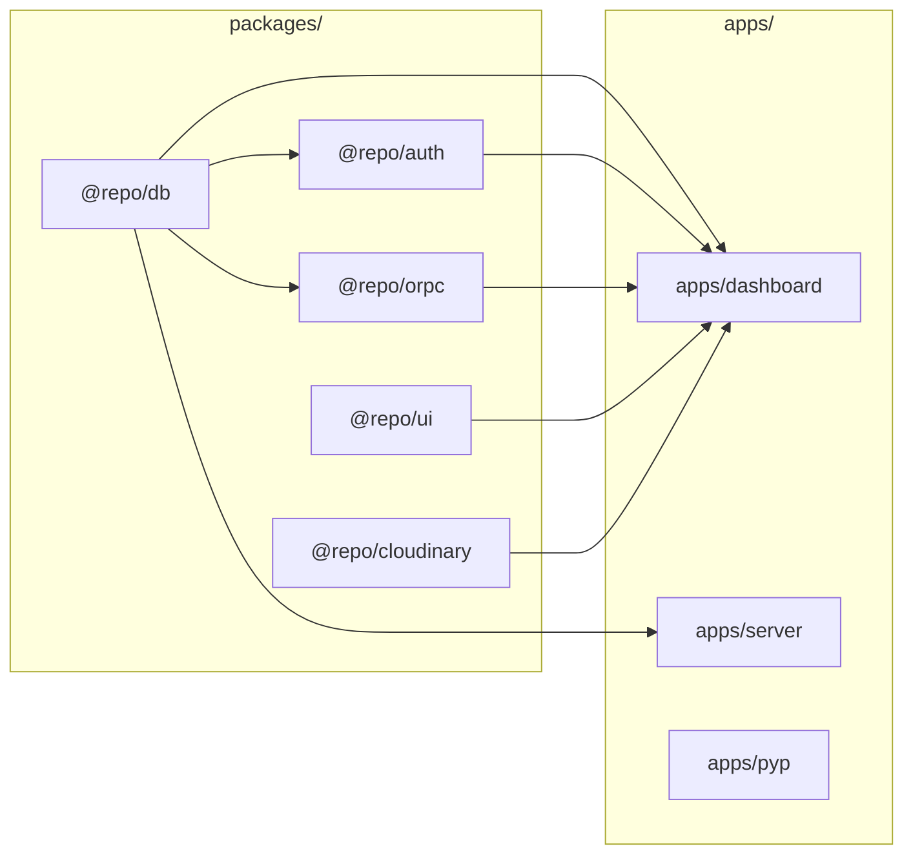

# System Architecture Overview

The **UNIXL (Campus)** platform is built as a modular, high-performance monorepo designed for visual workflow automation, real-time dataset collaboration, spreadsheet manipulation, and AI assistance.

---

## 📐 System Architecture Diagram

---

## ⚡ Core Communication Flows

### 1. User Authentication
* **Client**: Uses `authClient` from `apps/dashboard/lib/auth-client.ts` to trigger Google OAuth or Email sign-in.
* **Server**: Proxied through `apps/dashboard/app/api/auth/[...all]/route.ts` which invokes `betterAuth` in `packages/auth-cation`.
* **Persistence**: Auth session is saved directly to PostgreSQL via Prisma ORM (`@repo/db`).
* Learn more: [[Features/Authentication-Flow]].

### 2. Workflow & Desk Block Execution
* **Client**: Workflow canvas built with React Flow in `apps/dashboard`. User adds data blocks or nodes.
* **Express Server**: Handles desk block persistence (`/api/v1/desk/:projectWorkflowId/blocks`) and column-reservation commits to `MasterSheet`.
* **Python Engine**: High-performance calculations (matrix operations, formula evaluations, cell transformations) delegate to `apps/pyp` via HTTP endpoints (`/calculate`, `/formula`, `/transform`).
* Learn more: [[Apps/Dashboard]], [[Apps/Server]], and [[Apps/Pyp-Python-AI]].

### 3. Real-Time Collaboration & WebSockets
* **Express WS Manager**: Operates on `ws://localhost:5000/ws`.
* **Subscriptions**: Clients register with `userId` query parameter or `AUTHENTICATE` payload.
* **Notifications**: Team invite status changes, data commits, and system messages are pushed to connected user sockets in real time.
* Learn more: [[Features/API-Reference]].

---

## ⚙️ Monorepo Shared Package Architecture

* **`@repo/db`**: Exported Prisma client for all Node/Next services.
* **`@repo/auth`**: Better Auth engine built on top of `@repo/db`.
* **`@repo/orpc`**: Type-safe RPC router built on top of `@repo/db`.
* **`@repo/ui`**: Shared design system for shadcn/Radix components.
* **`@repo/cloudinary`**: Common media uploader wrapper.

---

## 🔗 Related Notes
* [[Architecture/Folder-Structure]] — Monorepo file breakdown.
* [[Features/Database-Schema]] — Detailed Prisma database structure.
* [[Operations/Build-and-Deployment]] — How the monorepo builds and deploys.
