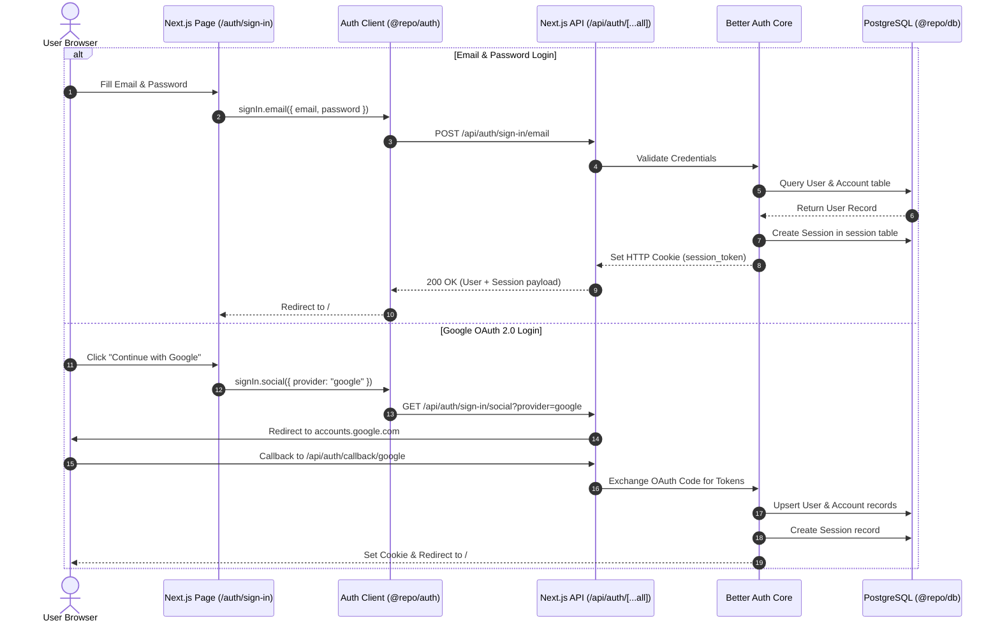

# Authentication Flow

Authentication in UNIXL is managed by **Better Auth** (`@repo/auth`), backed by PostgreSQL database tables (`user`, `session`, `account`, `verification`) managed through Prisma ORM (`@repo/db`).

---

## 🔁 Authentication Lifecycle Diagram

---

## 🗄️ Related Database Tables

* **`User`**: Core user profile (stores `id`, `name`, `email`, `image`, API keys for Gemini/OpenAI/Claude).
* **`Session`**: Active browser sessions (stores `token`, `expiresAt`, `ipAddress`, `userAgent`).
* **`Account`**: OAuth provider links (stores `providerId`, `accessToken`, `refreshToken`, `password` hash for credentials).
* **`Verification`**: Temporary verification tokens for email confirmation or password reset.

---

## 🔒 Security Observations & Recommendations

> [!WARNING]
> The Express server (`apps/server`) currently receives `userId` via `req.query.userId` or `req.body.userId`. Implementing an auth middleware in `apps/server` to validate the `Session` cookie token against Prisma before fulfilling API requests is strongly recommended.

---

## 🔗 Related Notes
* [[Packages/Auth-Package]] — `@repo/auth` configuration.
* [[Packages/Database-Package]] — Database models for identity tables.
* [[Apps/Dashboard]] — Frontend authentication forms and views.
