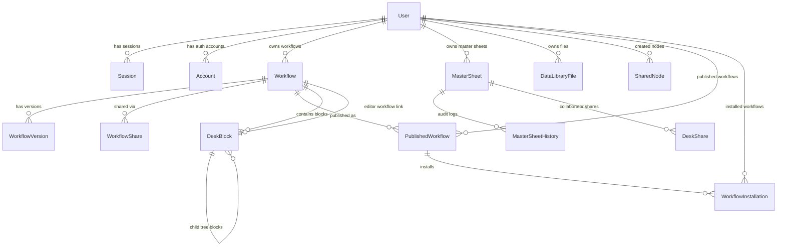

# Database Schema & Entity Relationship Diagram

The PostgreSQL database schema is defined using Prisma ORM in [`packages/database/prisma/schema.prisma`](file:///D:/vscodes/turborepo/f6/packages/database/prisma/schema.prisma).

---

## 📊 Entity Relationship Diagram (ERD)

---

## 📋 Data Model Reference

### 1. Identity & Auth Models
* **`User`**: Core user record. Key fields: `id`, `email`, `name`, `geminiApiKey`, `openaiApiKey`, `claudeApiKey`.
* **`Session`**: Session tokens (`id`, `token`, `expiresAt`, `userId`).
* **`Account`**: Provider auth mapping (`providerId`, `accessToken`, `refreshToken`, `password`).
* **`Verification`**: Auth verification tokens (`identifier`, `value`, `expiresAt`).

### 2. Workflow Models
* **`Workflow`**: Core canvas project definition. Key fields: `id`, `userId`, `name`, `definition` (JSON), `isPublic`, `isTemplate`.
* **`WorkflowVersion`**: Historical snapshots (`workflowId`, `version`, `definition`, `changeNote`).
* **`WorkflowShare`**: Sharing permissions (`workflowId`, `sharedWith`, `permission`).
* **`PublishedWorkflow`**: Shared marketplace template (`publisherId`, `inputSchema`, `outputSchema`, `downloads`).
* **`WorkflowInstallation`**: User-installed marketplace workflows (`userId`, `publishedWorkflowId`, `config`).

### 3. Data Library & Shared Nodes
* **`DataLibraryFile`**: Uploaded datasets (`userId`, `workflowId`, `name`, `fileType`, `data`, `metadata`).
* **`SharedNode`**: Marketplace node template (`creatorId`, `shareKey`, `expectedColumns`, `data`, `status`).

### 4. Desk & Master Sheet Collaboration Models
* **`MasterSheet`**: Shared central spreadsheet (`userId`, `name`, `data`: `{columns, data}`, `metadata`).
* **`MasterSheetHistory`**: Audit trail for sheet merges (`masterSheetId`, `userId`, `action`, `dataBefore`, `dataAfter`, `changeSummary`).
* **`DeskShare`**: Collaborator permissions (`masterSheetId`, `invitedEmail`, `permission`, `reservedColumns`).
* **`DeskBlock`**: Hierarchical canvas block (`projectWorkflowId`, `editorWorkflowId`, `parentId`, `treeDepth`, `reservedColumns`, `textInputs`, `sheets`, `outputPreview`, `checkboxFields`).

### 5. Notification Model
* **`Notification`**: Real-time user alert (`userId`, `type`, `title`, `message`, `data`, `read`).

---

## 🔗 Related Notes
* [[Packages/Database-Package]] — Prisma adapter setup.
* [[Apps/Server]] — Express API handlers querying database models.
* [[Apps/Dashboard]] — Frontend UI rendering database states.
