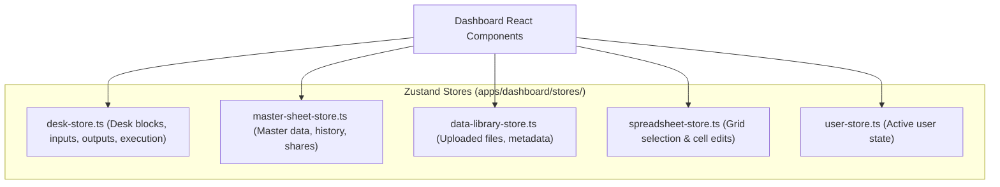

# UI Architecture & Component System

The UNIXL frontend architecture (`apps/dashboard`) is designed for complex data visualization, visual node routing, and spreadsheet editing.

---

## 🎨 Design System & Packages

* **Package**: [`packages/ui`](file:///D:/vscodes/turborepo/f6/packages/ui) (`@repo/ui`)
* **Styling**: Tailwind CSS + Radix UI Primitives + Lucide React.
* **Component Gallery**: 55+ production UI components including accordion, dialogs, drawers, tables, command menus, charts, and spotlights.

---

## 📐 Key Frontend UI Components

### 1. Visual Workflow Canvas (`components/dashboard/flow/`)
* **Base Node** ([`baseNode.tsx`](file:///D:/vscodes/turborepo/f6/apps/dashboard/components/dashboard/flow/Node/baseNode.tsx)): Renders standard canvas node containers with connection handles, header titles, status indicators, and sub-actions.
* **Node Drawer** ([`drawer.tsx`](file:///D:/vscodes/turborepo/f6/apps/dashboard/components/dashboard/flow/Node/drawer.tsx)): Side panel drawer for configuring node-specific inputs, parameters, formulas, and schema mappings.

### 2. Spreadsheet & Master Sheet System (`components/dashboard/sheet/`)
* **Master Sheet Panel** ([`masterSheetPanel.tsx`](file:///D:/vscodes/turborepo/f6/apps/dashboard/components/dashboard/sheet/masterSheetPanel.tsx)): Main interface for interacting with `MasterSheet` models, column locks, merge histories, and reserved column permissions.
* **Sync Sheet** ([`syncSheet.tsx`](file:///D:/vscodes/turborepo/f6/apps/dashboard/components/dashboard/sheet/syncSheet.tsx)): Real-time spreadsheet grid syncing block outputs to the central sheet.
* **Data Source** ([`datasource.tsx`](file:///D:/vscodes/turborepo/f6/apps/dashboard/components/dashboard/sheet/datasource.tsx)): Handles file import dropzones and database table links.

---

## 🧠 State Management Architecture

---

## 🔗 Related Notes
* [[Apps/Dashboard]] — Dashboard Next.js app details.
* [[Packages/UI-Package]] — Shared `@repo/ui` package components list.
* [[Features/API-Reference]] — Backend endpoints called by UI state stores.
