# 🚀 UNIXL (Campus) Workspace Documentation Vault

Welcome to the **UNIXL (Campus)** Obsidian Knowledge Base. This vault provides comprehensive, interconnected documentation for the entire Turborepo monorepo architecture, applications, shared packages, data models, APIs, and operational workflows.

---

## 📌 Quick Navigation Map

```mermaid
graph TD
    Index["Index.md (Vault Home)"]
    
    subgraph Architecture ["System Architecture"]
        SysOverview["[[Architecture/System-Overview|System Overview]]"]
        FolderStruct["[[Architecture/Folder-Structure|Folder Structure]]"]
    end

    subgraph Applications ["Applications (apps/)"]
        DashApp["[[Apps/Dashboard|Dashboard (Next.js)]]"]
        ServerApp["[[Apps/Server|Server (Express + WS)]]"]
        PypApp["[[Apps/Pyp-Python-AI|Pyp (FastAPI AI)]]"]
        MicroAgent["[[Apps/MicroSheetAgent|MicroSheetAgent (LangChain)]]"]
    end

    subgraph SharedPackages ["Shared Packages (packages/)"]
        DbPkg["[[Packages/Database-Package|@repo/db (Prisma)]]"]
        AuthPkg["[[Packages/Auth-Package|@repo/auth (Better Auth)]]"]
        RpcPkg["[[Packages/RPC-Package|@repo/orpc (ORPC Router)]]"]
        UiPkg["[[Packages/UI-Package|@repo/ui (Tailwind/Radix)]]"]
        CloudPkg["[[Packages/Cloudinary-Package|@repo/cloudinary]]"]
    end

    subgraph FeatureDocs ["Core Features & Specs"]
        AuthFlow["[[Features/Authentication-Flow|Authentication Flow]]"]
        DbSchema["[[Features/Database-Schema|Database Schema & ERD]]"]
        ApiRef["[[Features/API-Reference|API & WebSocket Reference]]"]
        UiComponents["[[Features/UI-and-Components|UI Architecture & State]]"]
    end

    subgraph OpsDocs ["Operations & Setup"]
        EnvVars["[[Operations/Environment-Variables|Environment Variables]]"]
        BuildDeploy["[[Operations/Build-and-Deployment|Build & Deployment Guide]]"]
    end

    Index --> SysOverview
    Index --> FolderStruct
    Index --> DashApp
    Index --> ServerApp
    Index --> PypApp
    Index --> MicroAgent
    Index --> DbPkg
    Index --> AuthPkg
    Index --> RpcPkg
    Index --> UiPkg
    Index --> CloudPkg
    Index --> AuthFlow
    Index --> DbSchema
    Index --> ApiRef
    Index --> UiComponents
    Index --> EnvVars
    Index --> BuildDeploy
```

---

## 📚 Vault Contents by Category

### 1. 🏗️ Architecture & Organization
* [[Architecture/System-Overview]] — High-level architecture, technology stack, and cross-service communication.
* [[Architecture/Folder-Structure]] — Monorepo layout detailing `apps/` and `packages/`.

### 2. 📱 Applications (`apps/`)
* [[Apps/Dashboard]] — Main Next.js (App Router) frontend platform with visual node flow editor & master sheets.
* [[Apps/Server]] — Express.js Node server handling REST endpoints, real-time WebSockets, and collaboration.
* [[Apps/Pyp-Python-AI]] — FastAPI Python server handling high-performance data math, formulas, file extraction, and AI routes.
* [[Apps/MicroSheetAgent]] — Specialized LangChain agent application with dedicated frontend and Python agent server.

### 3. 📦 Shared Packages (`packages/`)
* [[Packages/Database-Package]] — `@repo/db`: Prisma ORM client with PostgreSQL adapter (`@prisma/adapter-pg`).
* [[Packages/Auth-Package]] — `@repo/auth`: Better Auth setup with Prisma database integration & Google OAuth.
* [[Packages/RPC-Package]] — `@repo/orpc`: End-to-end type-safe RPC router powered by `@orpc/server`.
* [[Packages/UI-Package]] — `@repo/ui`: Central UI design system built on Radix UI, Tailwind CSS, and shadcn/ui.
* [[Packages/Cloudinary-Package]] — `@repo/cloudinary`: Media upload SDK wrapper for Cloudinary integration.

### 4. 🔑 Core Specifications & Features
* [[Features/Authentication-Flow]] — Detailed lifecycle for Email/Password and Google OAuth authentication.
* [[Features/Database-Schema]] — Interactive Entity Relationship Diagram (ERD) and table specs for Prisma models.
* [[Features/API-Reference]] — Comprehensive REST, WebSocket, FastAPI, and ORPC endpoint specs.
* [[Features/UI-and-Components]] — Zustand store architecture, React Flow node editor, and sheet management UI.

### 5. 🛠️ Operations & Environment
* [[Operations/Environment-Variables]] — Centralized registry of all environment variables across packages and apps.
* [[Operations/Build-and-Deployment]] — Turborepo workspace commands, pnpm scripts, and production build pipelines.

---

## 🛠️ Key Monorepo Tech Stack

| Domain | Technology / Framework |
| :--- | :--- |
| **Monorepo Engine** | Turborepo (`2.6.0`), pnpm Workspaces (`9.15.9`) |
| **Frontend UI** | Next.js 15 (App Router), React 19, Tailwind CSS, Lucide React, Zustand, React Flow |
| **Backend REST & WS** | Express.js, `ws` (WebSockets), Node.js (>=18) |
| **Python AI & Data** | FastAPI, Pandas, PyPDF2/pdfplumber, python-pptx, LangChain |
| **Database & ORM** | PostgreSQL, Neon DB / Supabase, Prisma ORM (`6.x`) with `@prisma/adapter-pg` |
| **Auth & RPC** | Better Auth, Google OAuth 2.0, `@orpc/server`, `@orpc/client` |
