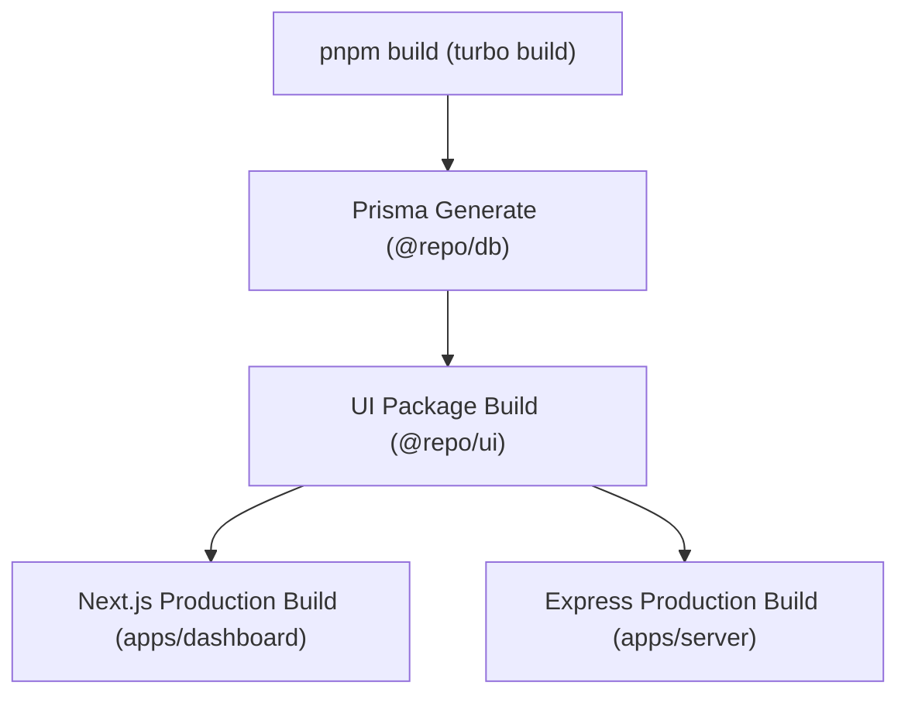

# Build and Deployment Guide

This note outlines how to run development servers, generate Prisma database clients, execute TypeScript type checking, linting, and deploy UNIXL applications to production targets.

---

## 🛠️ Prerequisites & Package Manager

* **Node.js**: `>=18`
* **Package Manager**: `pnpm` (v`9.15.9`)
* **Monorepo Engine**: `turbo` (v`2.6.0`)

---

## 🚀 Development Workflow Scripts

Execute these scripts from the monorepo root directory:

```bash
# 1. Install all dependencies across workspace
pnpm install

# 2. Run all applications in parallel in development mode
pnpm dev
# Or using global turbo:
turbo dev

# 3. Target a specific application to run locally
pnpm --filter dashboard dev    # Runs Next.js Dashboard on http://localhost:3002
pnpm --filter server dev       # Runs Express Backend on http://localhost:5000
```

---

## 🗄️ Database & Prisma Commands

```bash
# Generate Prisma Client types in packages/database
cd packages/database
pnpm exec prisma generate

# Apply pending database migrations to PostgreSQL
pnpm exec prisma migrate dev

# Open Prisma Studio web browser database interface
pnpm exec prisma studio
```

---

## 🏗️ Build Pipelines (`turbo.json`)



### Production Build Command
```bash
# Build all apps and packages in parallel using Turborepo cache
pnpm build

# Typecheck all TypeScript files
pnpm check-types

# Format codebase with Prettier
pnpm format
```

---

## ☁️ Production Deployment Targets

1. **`apps/dashboard` (Next.js)**:
   * **Target**: Vercel.
   * **Config**: Connected to PostgreSQL Neon DB / Supabase pooler via `DATABASE_URL`.
2. **`apps/server` (Express REST & WS)**:
   * **Target**: Render / Railway / AWS ECS / Node.js container host supporting WebSockets.
3. **`apps/pyp` (FastAPI Python AI)**:
   * **Target**: Vercel (via [`apps/pyp/vercel.json`](file:///D:/vscodes/turborepo/f6/apps/pyp/vercel.json)) or Modal / Railway Python runtime.

---

## 🔗 Related Notes
* [[Architecture/Folder-Structure]] — Monorepo file structure.
* [[Operations/Environment-Variables]] — Required environment variables for build/deployment.
* [[Index]] — Vault homepage.
